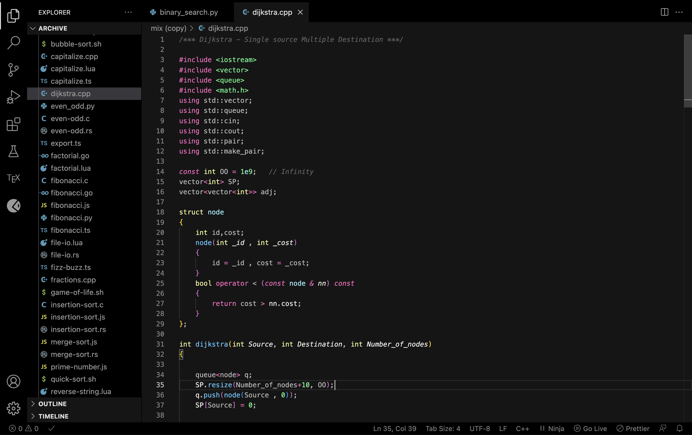
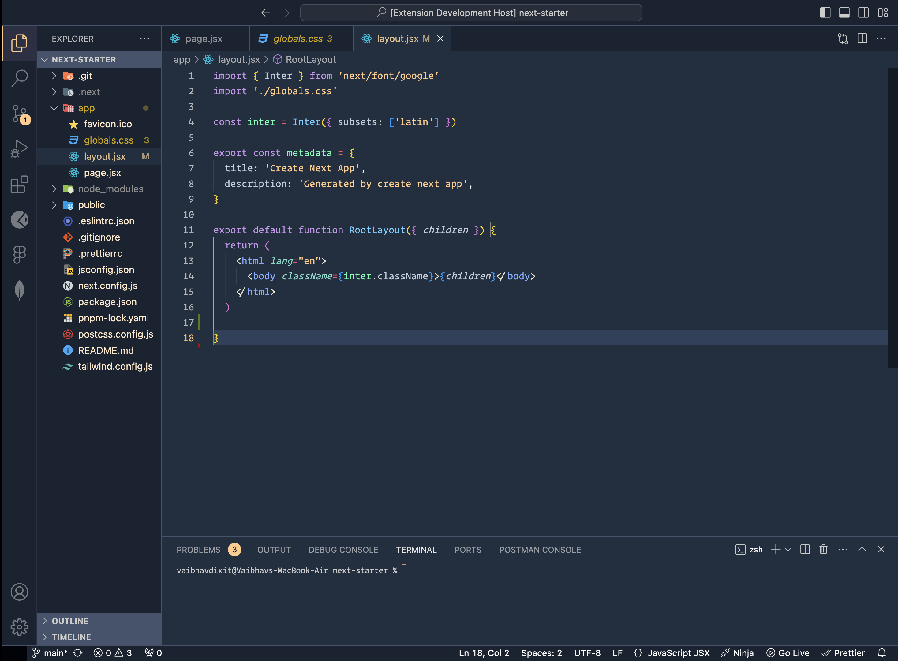

# Darkalchemy

## WIP 

#### Testing this theme

* `⌘+⇧+d` for testing theme before release.

or

* Add code to your settings.json.

#### Screenshot
<!--  -->

<table  style="width:100%">
  <tr>
    <td>
     
    <h5>DarkAlchemy</h5>
    </td>
    <td>
    <h5>DarkAlchemy-Arctic-Ruled</h5></td>
  </tr>
 
</table>

**Enjoy!**